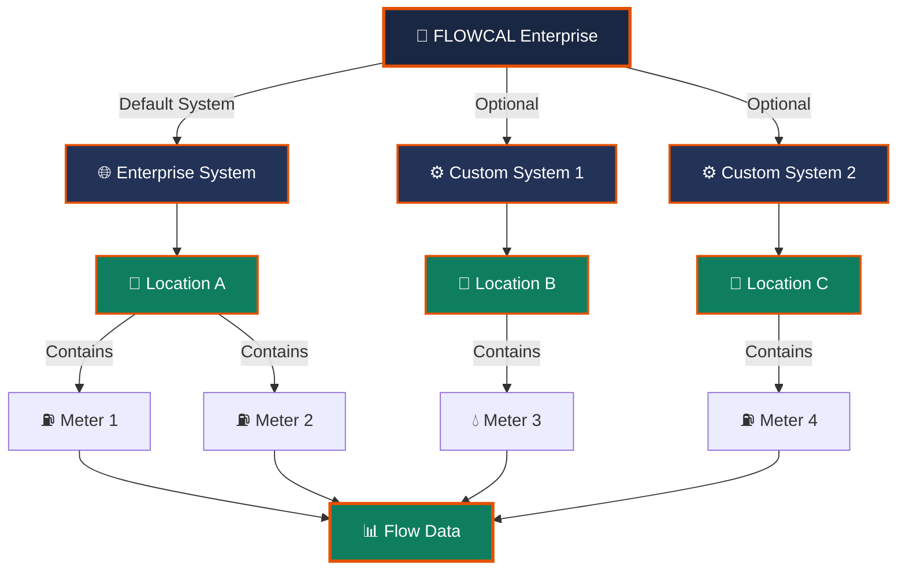

# Locations and Systems

## Core Concepts & Fundamentals

Covers the concept of a FLOWCAL system (with "enterprise" as the default) and how
locations are set up so that one or more meters can be added to them.

## FLOWCAL System Architecture

## Systems and Enterprise

FLOWCAL has a default system called enterprise. A customer may set up additional
systems - for example, a separate system using a different set of units - alongside the
default enterprise system.

- The default FLOWCAL system is called enterprise.
- Additional systems can be configured, such as one using a different unit set,
  alongside enterprise.

## Adding Meters to a Location

A location represents a physical or logical grouping in FLOWCAL, and it is possible for
multiple meters to belong to the same location. Meters are added to a location as part
of setting it up.

- A single location can contain multiple meters.
- Meters are attached to a location during location setup.

## Location Organization Levels

| Level | Purpose | Example |
|---|---|---|
| **System** | Top-level unit (enterprise or custom) | Enterprise (default units) |
| **Location** | Physical/logical grouping | Well Site A, Pipeline Station 3 |
| **Meter** | Individual measurement device | Coriolis Meter #42 |
| **Data** | Raw readings captured | Hourly volume readings |
| **Results** | Calculated flow values | Standardized BOPD (barrels/day) |

## See Also

- [Liquid Meter and Product Setup](volume-editor.md)
- [Tickets Overview](tickets.md)
- [Rollup Viewer Basics](rollup-viewers.md)

## Implementation Details

### Location Hierarchy Diagrams

### Meter-to-Location Mapping

---

## Implementation Details

## Overview

- # About Locations

 About Locations A location is a collection of one or more meters and/or other locations.
- Locations are used for balancing, determining pipeline efficiency and reporting (such as producer total volumes, fuel by area, or emissions reporting).

## Key Characteristics

- Within a location, member data is totaled or averaged, and is available at an hourly, daily, or monthly basis.
- In the following example, five meter members have been added to a location.
- When the location is rolled up, the volume and energy values are totaled, and the values for pressure and heating are averaged using weighted averaging.
- Volume Energy Pressure Heat Value MET_1 100.0 105.0 150.0 1050.0 MET_2 100.0 105.0 175.0 1050.0 MET_3 100.0 105.0 125.0 1050.0 MET_4 200.0 220.0 165.0 1100.0 MET_5 200.0 220.0 145.0 1100.0 LOC1 700.0 755.0 152.9 1078.6 Location Types Locations can be used to model stations, laterals, segments, balances, and inventories, as indicated in the following table: Legend Meter Segment Station Balance Segment A segment is a physical or logical section of a pipeline; made up of meters and/or other locations.
- Data Considerations All segments require a base direction.
- The segment’s direction represents its general contribution to the overall system and dictate how the total is calculated: Inlet : Total = [(Sum of Inlets) – (Sum of Outlets)] Outlet : Total = [(Sum of Outlets) – (Sum of Inlets)] Segment locations with a "Throughput" direction can only have throughput meters as members.

## Related Topics

- Configuration and Setup
- Data Management
- Reports and Analytics

