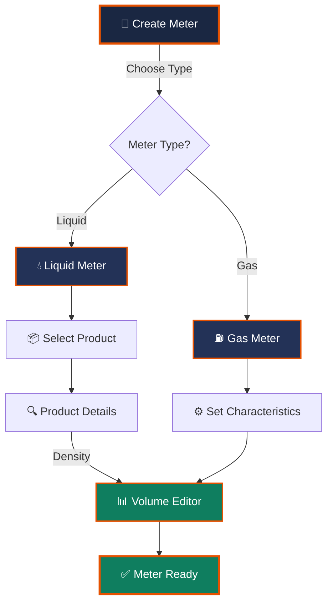
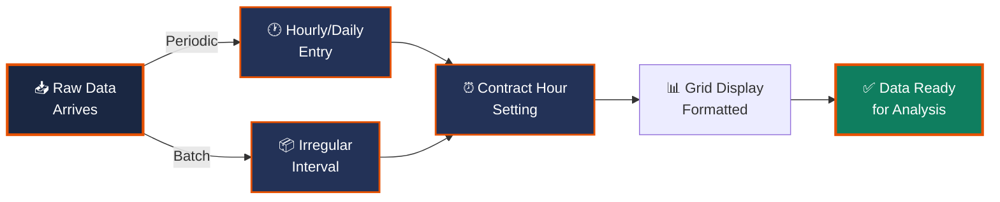

# Liquid Meter and Product Setup

## Core Concepts & Fundamentals

Walks through creating a liquid meter and its product in FLOWCAL, how product density
and units feed the meter, how meter factor and pressure/temperature base default from
the product, and the difference between periodic (e.g. hourly) and batch data entry,
including the contract hour/day setting.

## Meter Creation Workflow

## Creating a Liquid Meter

A meter is created either from a shortcut or by going to Setup > Create Meter, where the
type is chosen as either a gas meter or a liquid meter. Once the meter is created, its
characteristics are set up, after which the Volume Editor can be used to see how flow
data is calculated.

- Meters can be created via a shortcut or through Setup > Create Meter.
- At creation, a meter is chosen as either a gas meter or a liquid meter.
- After characteristics are set up, the Volume Editor shows how flow data calculates for
  that meter.

## Product Setup and Density

Creating a liquid meter requires selecting or creating its product. A common choice is a
Table E product, which prompts for a density value - density does not need to be filled
in if not required, but the unit for the product must still be selected.

- A liquid meter is tied to a product (e.g. a Table E product).
- Table E products prompt for density, though a value is not always required.
- The product's unit selection is still required.

## Meter Factor and Pressure/Temperature Base

Once a product is selected for the meter, FLOWCAL pulls the pressure base and
temperature base from the product automatically; any remaining fields must be filled in
manually. Meter factor is usually left at its default value of one.

- Pressure base and temperature base default from the selected product.
- Meter factor defaults to one in typical setups.

## Data Entry Flow

## Periodic vs Batch Data and Contract Hour

Data entry can be periodic (e.g. hourly, where the grid shows one row per hour) or
batch, where liquid data arrives less frequently, such as every two or fifteen days,
rather than on a fixed period. A related setting is the contract hour and day, which
defines the start of the operating day (for example, starting at 9 o'clock on the first
day of the month) - this selection determines how the data grid is displayed.

- Periodic (e.g. hourly) entry shows one grid row per period.
- Batch data arrives at irregular intervals (e.g. every two or fifteen days) rather than
  on a fixed period.
- Contract hour and day define when the operating day/month starts and control how the
  data grid displays.

## Volume Editor Controls

| Control | Function | Impact |
|---|---|---|
| **Data Grid** | Enter volume readings | Triggers flow calculation |
| **Contract Hour** | Set day start time | Affects grid layout |
| **Period Type** | Choose Periodic/Batch | Changes data frequency |
| **Meter Factor** | Adjustment multiplier | Modifies flow results |
| **Pressure/Temp** | Base references | Standardizes flow values |

## See Also

- [Meter Fundamentals](meters.md)
- [Locations and Systems](locations.md)
- [Meter Editor Overview](meter-editor.md)
