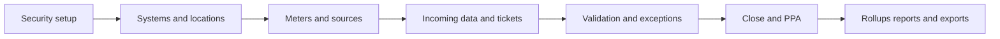

---
tags:
  - home
  - overview
---

AgentVerse Knowledge Hub

# FLOWCAL Knowledge Hub

Training sessions, product help, and team knowledge in one focused workspace. Follow
the meter-to-report journey, learn each entity, and find answers when work is waiting.

<a href="getting-started/flowcal-data-journey/">Start the data journey</a>
<a href="help/">Search product help</a>

<a class="hub-primary-link" href="getting-started/flowcal-data-journey/">
  New to FLOWCAL?
  <strong>Follow the data journey</strong>
  Start with security, then move from meter setup to tickets, close, rollups, and reporting.
</a>

<a class="hub-primary-link" href="help/">
  Need an answer now?
  <strong>Search the product help library</strong>
  Browse the imported FLOWCAL help documentation or use the search field above.
</a>

## See It In Motion

  

  

    
    
  

  

    
Step 1 · Overview

    <h2 class="vs-title">The FLOWCAL Data Journey</h2>
    
From securing access with users and groups, to creating a liquid meter and its location, through validation, exceptions, PPA approval, imports, and rollups into reports — this is the path data takes through FLOWCAL.

  

  

  

    

Enterprise (System)

    
↓

    

Location

    
↓

    

      
Meter A

      
Meter B

    

  

  

    
Step 2 · Locations

    <h2 class="vs-title">Locations &amp; Systems</h2>
    
A single location can host multiple meters underneath a system — this is the structure every workflow in FLOWCAL builds on.

  

  

  

    

      

      

      

      

    

    Minute
    Super
    Monthly
  

  

    
Step 3 · Rollups

    <h2 class="vs-title">From Detail to Report</h2>
    
Data aggregates from minute-level detail up through super and monthly totals, ready for reporting.

  

<!-- CONTROLS -->

  <button class="vs-btn vs-prev-btn" aria-label="Previous slide">‹</button>
  

  <button class="vs-btn vs-next-btn" aria-label="Next slide">›</button>
  <button class="vs-btn vs-play-btn" aria-label="Pause/Play">⏸</button>

<a href="visual/">Watch the full animated data journey →</a>

## Learn by Goal

-   :material-rocket-launch-outline: **Start here**

    ---

    Learn the product language, navigation, and end-to-end data journey.

    [Open the learning path](getting-started/flowcal-data-journey.md)

-   :material-database-cog-outline: **Set up and administer**

    ---

    Find users, systems, configuration, application installation, and database guidance.

    [Explore administration](help/Content/FLOWCAL%2010/Admin%20Options/Install%20%26%20Configure%20Services.md)

-   :material-gas-station-outline: **Work with product entities**

    ---

    Understand meters, locations, products, sources, assignments, and their relationships.

    [Explore meters](core-features/meters.md)

-   :material-clipboard-check-outline: **Run daily operations**

    ---

    Handle imports, tickets, validation, close workflows, and PPA approvals.

    [Explore tickets](core-features/tickets.md)

-   :material-chart-timeline-variant-shimmer: **Understand the flow visually**

    ---

    Step through FLOWCAL's entity hierarchy and data journey with interactive visuals.

    [Open visual story](visual/index.md)

-   :material-book-search-outline: **Use detailed product help**

    ---

    Search the full internal help library for specific screens, settings, and procedures.

    [Open Help Library](help/index.md)

## The FLOWCAL Operating Model

Use the global search to find a specific feature, or start with the visual story to see
how the entities connect.

