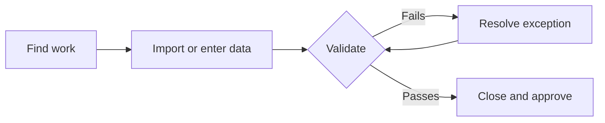

---
tags:
  - operations
  - workflow
---

# Daily Operations

Daily work is a controlled loop: find work, bring in or enter data, resolve any
exceptions, close the period, and request approval for post-close changes.

<svg viewBox="0 0 24 24" fill="currentColor"><path d="M15.5 14h-.79l-.28-.27C15.41 12.59 16 11.11 16 9.5 16 5.91 13.09 3 9.5 3S3 5.91 3 9.5 5.91 16 9.5 16c1.61 0 3.09-.59 4.23-1.57l.27.28v.79l5 4.99L20.49 19l-4.99-5m-6 0C7.01 14 5 11.99 5 9.5S7.01 5 9.5 5 14 7.01 14 9.5 11.99 14 9.5 14z"/></svg>

Find

<svg viewBox="0 0 24 24" fill="currentColor"><path d="M9 16h6v-6h4l-7-7-7 7h4z M5 18h14v2H5z"/></svg>

Import or enter

<svg viewBox="0 0 24 24" fill="currentColor"><path d="M12 1L3 5v6c0 5.55 3.84 10.74 9 12 5.16-1.26 9-6.45 9-12V5l-9-4m-1.4 15L6 11.4l1.4-1.4 3.2 3.2 6-6L18 8.6 10.6 16z"/></svg>

Validate

<svg viewBox="0 0 24 24" fill="currentColor"><path d="M22.7 19l-9.1-9.1c.9-2.3.4-5-1.5-6.9-2-2-5-2.4-7.4-1.3L9 6 6 9 1.7 4.7C.6 7.1 1 10.1 3 12.1c1.9 1.9 4.6 2.4 6.9 1.5l9.1 9.1c.4.4 1 .4 1.4 0l2.3-2.3c.4-.4.4-1 0-1.4z"/></svg>

Resolve

<svg viewBox="0 0 24 24" fill="currentColor"><path d="M12 17a2 2 0 0 0 2-2 2 2 0 0 0-2-2 2 2 0 0 0-2 2 2 2 0 0 0 2 2m6-9a2 2 0 0 1 2 2v10a2 2 0 0 1-2 2H6a2 2 0 0 1-2-2V10a2 2 0 0 1 2-2h1V6a5 5 0 0 1 5-5 5 5 0 0 1 5 5v2h1M12 3a3 3 0 0 0-3 3v2h6V6a3 3 0 0 0-3-3z"/></svg>

Close and approve

## Detailed Flow

## Work Queues and Data Entry

- [Lists](../help/Content/FLOWCAL%2010/List%20Editor/About%20Lists.md)
- [List editor](../help/Content/FLOWCAL%2010/List%20Editor/List%20Editor.md)
- [Meter data imports](../help/Content/FLOWCAL%2010/Imports/Meter%20Data/Import%20Meter%20Data.md)
- [Ticket imports](../help/Content/FLOWCAL%2010/Imports/Import%20Ticket%20Data.md)
- [Tickets](../help/Content/FLOWCAL%2010/Tickets/Ticket%20Editor.md)

## Control and Close

- [Run validations](../help/Content/FLOWCAL%2010/Tools/Toolbox/Run%20Validations.md)
- [Exception resolver](../help/Content/FLOWCAL%2010/Exceptions/Exception%20Resolver/Exception%20Resolver.md)
- [Close groups](../help/Content/FLOWCAL%2010/Close%20Data/Close%20Groups/About%20Close%20Groups.md)
- [Close schedule](../help/Content/FLOWCAL%2010/Close%20Data/Close%20Groups/Close%20Schedule.md)
- [Post-processing approval](../help/Content/FLOWCAL%2010/PPA/PPA%20Editor.md)