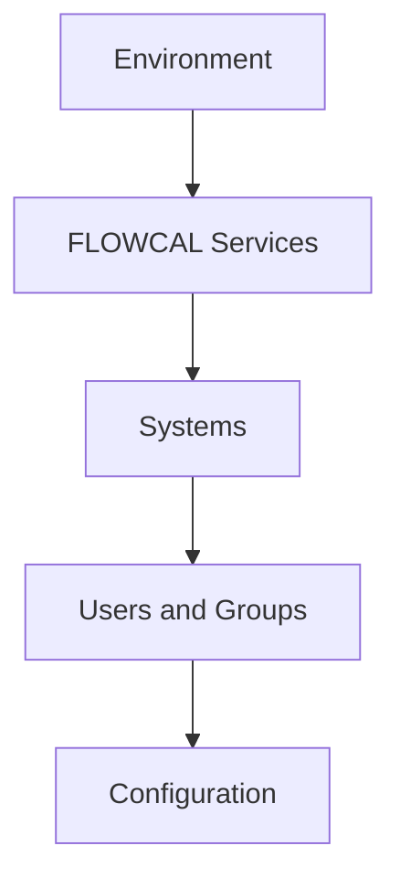

---
tags:
  - platform
  - administration
---

# Platform Setup and Administration

Use this area to prepare a FLOWCAL environment, establish access, and manage system-wide
configuration. Start with the application services and security model before configuring
business entities.

<svg viewBox="0 0 24 24" fill="currentColor"><path d="M17.9 17.39c-.26-.8-1.01-1.39-1.9-1.39h-1v-3a1 1 0 0 0-1-1H8v-2h2a1 1 0 0 0 1-1V7h2a2 2 0 0 0 2-2v-.41A7.984 7.984 0 0 1 20 12c0 2.08-.8 3.97-2.1 5.39M11 19.93c-3.95-.49-7-3.85-7-7.93 0-.62.08-1.21.21-1.79L9 15v1a2 2 0 0 0 2 2m1-16A10 10 0 0 0 2 12a10 10 0 0 0 10 10 10 10 0 0 0 10-10A10 10 0 0 0 12 2z"/></svg>

Environment

<svg viewBox="0 0 24 24" fill="currentColor"><path d="M19.43 12.98c.04-.32.07-.64.07-.98 0-.34-.03-.66-.07-.98l2.11-1.65c.19-.15.24-.42.12-.64l-2-3.46c-.12-.22-.39-.3-.61-.22l-2.49 1c-.52-.4-1.08-.73-1.69-.98l-.38-2.65A.488.488 0 0 0 14 1h-4c-.24 0-.44.18-.47.42l-.38 2.65c-.61.25-1.17.59-1.69.98l-2.49-1c-.22-.09-.49 0-.61.22l-2 3.46c-.13.22-.07.49.12.64l2.11 1.65c-.04.32-.07.65-.07.98s.03.66.07.98l-2.11 1.65c-.19.15-.24.42-.12.64l2 3.46c.12.22.39.3.61.22l2.49-1c.52.4 1.08.73 1.69.98l.38 2.65c.03.24.23.42.47.42h4c.24 0 .44-.18.47-.42l.38-2.65c.61-.25 1.17-.59 1.69-.98l2.49 1c.22.09.49 0 .61-.22l2-3.46c.12-.22.07-.49-.12-.64l-2.11-1.65zM12 15.5c-1.93 0-3.5-1.57-3.5-3.5s1.57-3.5 3.5-3.5 3.5 1.57 3.5 3.5-1.57 3.5-3.5 3.5z"/></svg>

Services

<svg viewBox="0 0 24 24" fill="currentColor"><path d="M12 3C7.58 3 4 4.79 4 7s3.58 4 8 4 8-1.79 8-4-3.58-4-8-4M4 9v3c0 2.21 3.58 4 8 4s8-1.79 8-4V9c0 2.21-3.58 4-8 4s-8-1.79-8-4m0 5v3c0 2.21 3.58 4 8 4s8-1.79 8-4v-3c0 2.21-3.58 4-8 4s-8-1.79-8-4z"/></svg>

Systems

<svg viewBox="0 0 24 24" fill="currentColor"><path d="M16 11c1.66 0 2.99-1.34 2.99-3S17.66 5 16 5c-1.66 0-3 1.34-3 3s1.34 3 3 3m-8 0c1.66 0 2.99-1.34 2.99-3S9.66 5 8 5C6.34 5 5 6.34 5 8s1.34 3 3 3m0 2c-2.33 0-7 1.17-7 3.5V19h14v-2.5c0-2.33-4.67-3.5-7-3.5m8 0c-.29 0-.62.02-.97.05 1.16.84 1.97 1.97 1.97 3.45V19h6v-2.5c0-2.33-4.67-3.5-7-3.5z"/></svg>

Users and groups

<svg viewBox="0 0 24 24" fill="currentColor"><path d="M3 17v2h6v-2H3M3 5v2h10V5H3m10 16v-2h8v-2h-8v-2h-2v6h2M7 9v2H3v2h4v2h2V9H7m14 4v-2H11v2h10m-6-4h2V7h4V5h-4V3h-2v6z"/></svg>

Configuration

## Detailed Flow

## Installation

- [Oracle Database installation guidance](installation.md#oracle-database) - environment-owned prerequisite; confirm the approved database build with the platform team.
- [FLOWCAL application services](../help/Content/FLOWCAL%2010/Admin%20Options/Install%20%26%20Configure%20Services.md) - configure FLOWCAL services after the database is ready.
- [SQL Developer setup](installation.md#sql-developer) - use the approved connection details and least-privilege account.

## Systems, Database Checks, and Security

- [Create systems](../help/Content/FLOWCAL%2010/Admin%20Options/Create%20Systems.md)
- [Create users](../help/Content/FLOWCAL%2010/Admin%20Options/Create%20Users.md)
- [Create security groups](../help/Content/FLOWCAL%2010/Admin%20Options/Create%20Security%20Groups.md)
- [Group access](../help/Content/FLOWCAL%2010/Settings%20Manager/Security/Group%20Access.md)
- [System configuration](../help/Content/FLOWCAL%2010/Settings%20Manager/System/System%20Configuration/System%20Configuration.md)

## Configuration Reference

For services, application fields, import rules, and global settings, use the
[full Product Help Library](../help/index.md). Search by the screen name when a setting
is not listed in the sidebar.