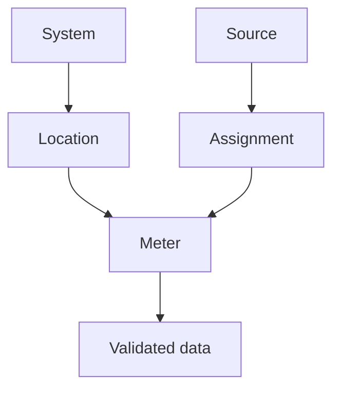

---
tags:
  - product-knowledge
  - entities
---

# Product Knowledge

FLOWCAL's operational model starts with connected entities. A system contains locations;
locations host meters; meters and sources provide data; assignments determine how
qualities are applied.

<svg viewBox="0 0 24 24" fill="currentColor"><path d="M12 3C7.58 3 4 4.79 4 7s3.58 4 8 4 8-1.79 8-4-3.58-4-8-4M4 9v3c0 2.21 3.58 4 8 4s8-1.79 8-4V9c0 2.21-3.58 4-8 4s-8-1.79-8-4m0 5v3c0 2.21 3.58 4 8 4s8-1.79 8-4v-3c0 2.21-3.58 4-8 4s-8-1.79-8-4z"/></svg>

System

Organizational boundary

<svg viewBox="0 0 24 24" fill="currentColor"><path d="M12 2C8.13 2 5 5.13 5 9c0 5.25 7 13 7 13s7-7.75 7-13c0-3.87-3.13-7-7-7m0 9.5A2.5 2.5 0 0 1 9.5 9 2.5 2.5 0 0 1 12 6.5 2.5 2.5 0 0 1 14.5 9 2.5 2.5 0 0 1 12 11.5z"/></svg>

Location

Operational place

<svg viewBox="0 0 24 24" fill="currentColor"><path d="M12,16A2,2 0 0,1 10,14C10,12.9 10.9,12 12,12A2,2 0 0,1 14,14A2,2 0 0,1 12,16M12,20A8,8 0 0,0 20,12A8,8 0 0,0 12,4A8,8 0 0,0 4,12A8,8 0 0,0 12,20M12,2A10,10 0 0,1 22,12A10,10 0 0,1 12,22A10,10 0 0,1 2,12A10,10 0 0,1 12,2M13,7H11V9.5L8.8,10.7L9.8,12.4L13,10.5V7Z"/></svg>

Meter

Measures volume

<svg viewBox="0 0 24 24" fill="currentColor"><path d="M12 2C6.48 2 2 6.48 2 12s4.48 10 10 10 10-4.48 10-10S17.52 2 12 2m-2 15l-5-5 1.41-1.41L10 14.17l7.59-7.59L19 8z"/></svg>

Data

Validated records

## Detailed Relationships

## Core Entities

- [Products and fluids](../core-features/volume-editor.md)
- [Systems](../help/Content/FLOWCAL%2010/Admin%20Options/Create%20Systems.md)
- [Locations](../help/Content/FLOWCAL%2010/Locations/About%20Locations.md)
- [Meters](../help/Content/FLOWCAL%2010/Meters/About%20Meters.md)
- [Sources](../help/Content/FLOWCAL%2010/Sources/About%20Sources.md)
- [Assignments](../help/Content/FLOWCAL%2010/Source%20Analysis/Quality%20Assignment%20Editor/Configuring%20Assignments.md)

## Relationships

Use the [entity relationship diagrams](../help/Content/FLOWCAL%2010/Admin%20Options/Entity%20Relationship%20Diagrams.md)
to inspect detailed data relationships. For a guided overview, open the
[visual data journey](../visual/index.md).