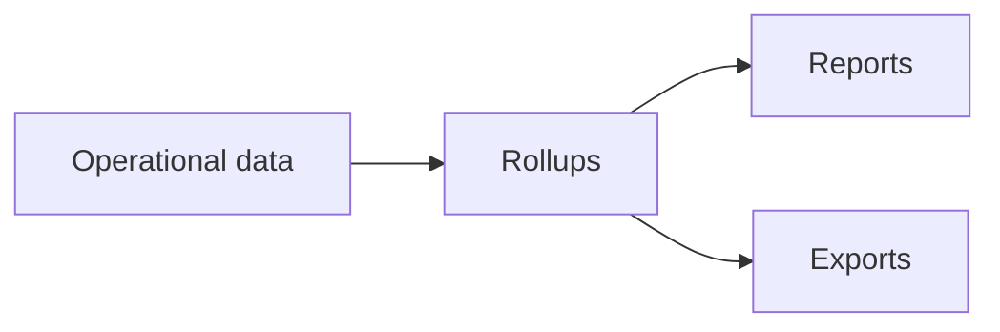

---
tags:
  - reporting
  - exports
---

# Reporting and Exports

Reporting is the final consumption layer of the FLOWCAL data flow. Use reports to review
processed results and exports to deliver approved data downstream.

<svg viewBox="0 0 24 24" fill="currentColor"><path d="M12 3C7.58 3 4 4.79 4 7s3.58 4 8 4 8-1.79 8-4-3.58-4-8-4M4 9v3c0 2.21 3.58 4 8 4s8-1.79 8-4V9c0 2.21-3.58 4-8 4s-8-1.79-8-4m0 5v3c0 2.21 3.58 4 8 4s8-1.79 8-4v-3c0 2.21-3.58 4-8 4s-8-1.79-8-4z"/></svg>

Operational data

Meters, tickets, sources

<svg viewBox="0 0 24 24" fill="currentColor"><path d="M12,16L19.36,10.27L21,9L12,2L3,9L4.63,10.27M12,18.54L4.62,12.81L3,14.07L12,21.07L21,14.07L19.37,12.8L12,18.54Z"/></svg>

Rollups

Aggregated results

<svg viewBox="0 0 24 24" fill="currentColor"><path d="M14 2H6a2 2 0 0 0-2 2v16a2 2 0 0 0 2 2h12a2 2 0 0 0 2-2V8l-6-6m2 16H8v-2h8v2m0-4H8v-2h8v2m-3-5V3.5L18.5 9H13z"/></svg>

Reports

Business output

<svg viewBox="0 0 24 24" fill="currentColor"><path d="M14 2H6a2 2 0 0 0-2 2v16a2 2 0 0 0 2 2h12a2 2 0 0 0 2-2V8l-6-6m4 18H6V4h7v5h5v11M12.5 11 15 13.5 13.94 14.56 12.5 13.12V17h-1v-3.88l-1.44 1.44L9 13.5z"/></svg>

Exports

Downstream delivery

## Detailed Flow

## Reports and Exports

- [Standard reports](../help/Content/FLOWCAL%2010/Reports/Standard%20Reports.md)
- [Stored reports](../help/Content/FLOWCAL%2010/Reports/Stored%20Reports.md)
- [Export a report](../help/Content/FLOWCAL%2010/Reports/Export%20a%20Report.md)
- [Exports](../help/Content/FLOWCAL%2010/Reports/Exports.md)
- [Export template editor](../help/Content/FLOWCAL%2010/Reports/Export%20Template%20Editor.md)

## Rollup Viewer

- [Rollup viewer basics](../core-features/rollup-viewers.md)
- [Source analysis rollups](../help/Content/FLOWCAL%2010/Rollup%20Viewers/Source%20Analysis%20Rollups/Source%20Analysis%20Rollups.md)